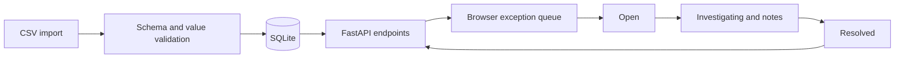

# Fulfillment Exception Manager

[](https://github.com/longshotnb-ux/fulfillment-exception-manager/actions/workflows/tests.yml)

A small operations workflow application for importing order data, finding late deliveries, documenting investigations, and tracking exceptions through resolution.

The project extends the same 40-row synthetic fulfillment dataset used in the companion operations analytics project. It demonstrates a browser-based product workflow—not just offline analysis—using FastAPI, SQLite, HTML, CSS, and JavaScript.

Companion project: [Operations Data Analysis](https://github.com/longshotnb-ux/operations-data-analysis)

## What it does

- Seeds SQLite from a synthetic order CSV on first launch
- Calculates late-order KPIs and revenue at risk
- Filters exceptions by status, region, order, fulfillment center, or category
- Tracks `Open`, `Investigating`, and `Resolved` workflow states
- Saves investigation notes without losing them during later CSV updates
- Validates raw CSV imports and rejects malformed or oversized input
- Uses parameterized SQL, server-side validation, and restrictive browser security headers

## Architecture



## Run locally

Requires Python 3.11 or newer.

```bash
python3 -m venv .venv
source .venv/bin/activate
python -m pip install -r requirements-dev.txt
uvicorn app.main:app --reload
```

Open [http://127.0.0.1:8000](http://127.0.0.1:8000). Interactive API documentation is available at [http://127.0.0.1:8000/docs](http://127.0.0.1:8000/docs).

## Run tests

```bash
pytest -q
```

GitHub Actions runs the same test suite for every push and pull request.

## CSV schema

Imports must include these columns:

```text
order_id,order_date,region,fulfillment_center,category,units,revenue,promised_days,actual_days,defect,returned
```

`order_date` uses `YYYY-MM-DD`; `defect` and `returned` use `0` or `1`. Imports are limited to 1 MB and 5,000 rows. Existing order IDs update the operational fields while preserving their workflow status and notes.

## API surface

- `GET /api/summary` — queue KPIs and workflow counts
- `GET /api/exceptions` — late-order queue with status, region, and search filters
- `PATCH /api/exceptions/{order_id}` — update a workflow status or note
- `POST /api/import` — import UTF-8 CSV content with `Content-Type: text/csv`
- `GET /health` — basic service health check

## Scope and production boundary

This is a portfolio MVP using synthetic data. It intentionally omits user accounts and role-based access; those would be required before deploying with real customer or operational data. A next iteration could add audit history, owner assignment, due dates, and authenticated deployment.
