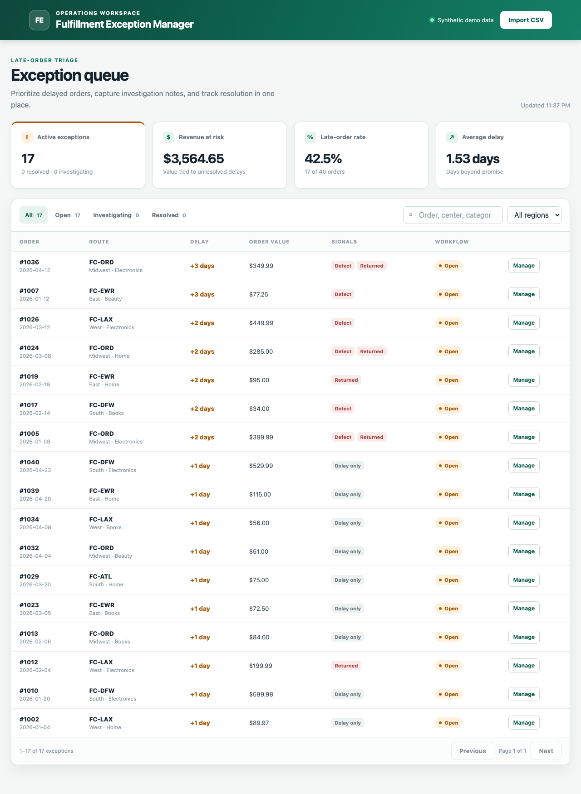
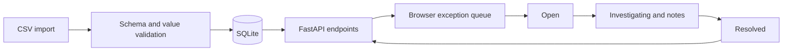

# Fulfillment Exception Manager

[](https://github.com/longshotnb-ux/fulfillment-exception-manager/actions/workflows/tests.yml)

A small operations workflow application for importing order data, finding late deliveries, documenting investigations, and tracking exceptions through resolution.

The project extends the same 40-row synthetic fulfillment dataset used in the companion operations analytics project. It demonstrates a browser-based product workflow—not just offline analysis—using FastAPI, SQLite, HTML, CSS, and JavaScript.

Companion project: [Operations Data Analysis](https://github.com/longshotnb-ux/operations-data-analysis)



Try the [one-minute walkthrough](docs/walkthrough.md) to investigate and resolve an order.

## What it does

- Seeds SQLite from a synthetic order CSV on first launch
- Calculates late-order KPIs and revenue at risk
- Filters exceptions by status, region, order, fulfillment center, or category
- Pages through every matching exception with an accurate filtered total
- Tracks `Open`, `Investigating`, and `Resolved` workflow states
- Saves investigation notes without losing them during later CSV updates
- Records timestamped before/after status and note changes, including cleared notes
- Validates raw CSV imports and rejects malformed or oversized input
- Uses parameterized SQL, server-side validation, and restrictive browser security headers

## Architecture



## Run locally

Requires Python 3.11 or newer.

```bash
python3 -m venv .venv
source .venv/bin/activate
python -m pip install -r requirements-dev.txt
uvicorn app.main:app --reload
```

Open [http://127.0.0.1:8000](http://127.0.0.1:8000). Interactive API documentation is available at [http://127.0.0.1:8000/docs](http://127.0.0.1:8000/docs).

For a disposable demo with the same synthetic data, use `python -m app.demo` instead of the Uvicorn command. It binds only to localhost and uses a new temporary database each launch; stopping it resets all demo edits and imports. The normal command above keeps changes in `data/exceptions.db`. Set `FEM_DATABASE_PATH` to choose a different persistent database.

## Run tests

```bash
pytest -q
```

GitHub Actions runs the same test suite on Python 3.11 and 3.12 for every push and pull request. Regression cases cover 501-record pagination, filtered totals, out-of-range integers, streamed upload limits, and history persistence across re-import and restart.

Optional browser regression checks require Node 22.13+ and pnpm 11.19.0 (the app itself needs only Python):

```bash
pnpm install --frozen-lockfile
pnpm exec playwright install chromium
pnpm test:browser
```

These checks start a fresh disposable demo on port 8780 and exercise paging, filter resets, resolution/history persistence, and slow filter responses. Activate the Python virtual environment first, or set `FEM_TEST_PYTHON` to its interpreter path. CI runs these checks with Chromium; failure traces and screenshots are uploaded as artifacts.

Set `UPDATE_PREVIEWS=1` when running the browser checks to refresh the two README/walkthrough screenshots from the real demo. Ordinary checks leave these tracked images unchanged.

## CSV schema

Imports must include these columns:

```text
order_id,order_date,region,fulfillment_center,category,units,revenue,promised_days,actual_days,defect,returned
```

`order_date` uses `YYYY-MM-DD`; `defect` and `returned` use `0` or `1`. Imports are limited to 1 MB and 5,000 rows. Existing order IDs update the operational fields while preserving their workflow status and notes.

Order IDs must be positive and no greater than `9007199254740991`, JavaScript's largest exactly represented integer, so distinct orders remain distinct in the browser. Other integer fields must fit SQLite's signed 64-bit range (maximum `9223372036854775807`); units must be positive, and delivery days non-negative. Revenue must be finite and non-negative, and the combined stored revenue must remain finite. Validation failures return HTTP 422 with an explanation, and the entire import is rejected without partial writes. Oversized uploads return HTTP 413, including streamed uploads without a declared length.

## API surface

- `GET /api/summary` — queue KPIs and workflow counts
- `GET /api/exceptions` — late-order queue with `status`, `region`, and `q` filters; `limit` (1–500, default 50) and `offset` (default 0). Returns `items`, full filtered `total`, `limit`, and `offset`. The browser uses 25 items per page.
- `GET /api/exceptions/{order_id}/history` — newest changes first, with `limit` (1–100, default 50), `offset`, and a full `total`
- `PATCH /api/exceptions/{order_id}` — update a workflow status or note
- `POST /api/import` — import UTF-8 CSV content with `Content-Type: text/csv`
- `GET /health` — basic service health check

## Scope and production boundary

This is a portfolio MVP using synthetic data. It intentionally omits user accounts and role-based access; those would be required before deploying with real customer or operational data. Change history records what changed and when, but cannot attribute changes to an authenticated person and is not a tamper-proof audit log. No-op saves do not add history. CSV refreshes preserve workflow/history and do not create workflow events. Existing databases gain the history table on startup; history begins with subsequent edits and is not reconstructed retroactively.

The disposable demo is local, not a hosted service. A shared public deployment would need session isolation or an explicit reset policy. Future work could add owner assignment, due dates, and authenticated deployment.
