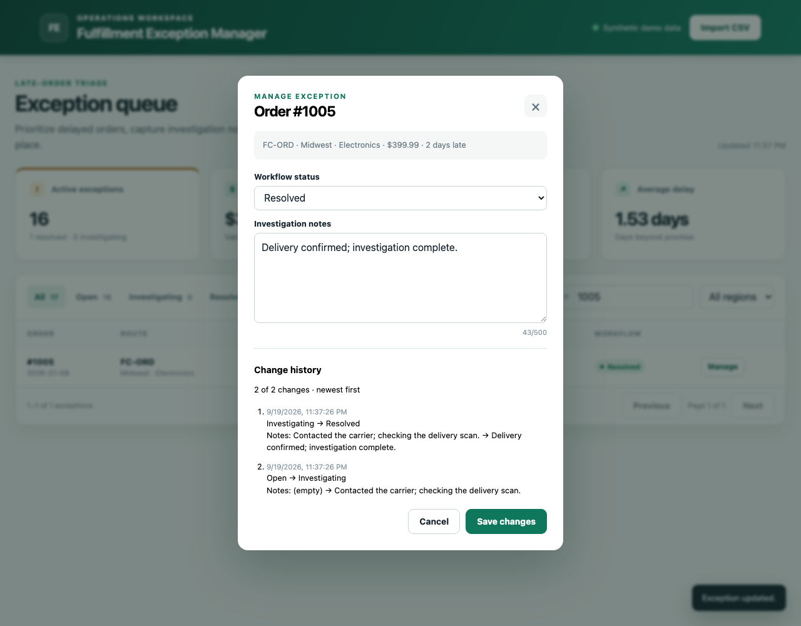

# One-minute synthetic-data walkthrough

After installing the dependencies in the README, run:

```bash
python -m app.demo
```

Open http://127.0.0.1:8000. This local demo starts with 40 synthetic orders and resets when stopped.

1. **Review the queue (0–10 seconds).** The fresh dataset has 17 late orders, a 42.5% late rate, and $3,564.65 tied to unresolved exceptions.
2. **Investigate (10–25 seconds).** Search for `1005`, select **Manage**, choose **Investigating**, and enter `Contacted the carrier; checking the delivery scan.` Save the change.
3. **Inspect the history (25–40 seconds).** Reopen **Manage**. Change history shows the timestamp, Open → Investigating, and the note. Refreshing the page preserves the change while the demo process remains running.
4. **Resolve (40–55 seconds).** Set **Resolved** and replace the note with `Delivery confirmed; investigation complete.` Save. Active exceptions fall to 16 and revenue at risk falls to $3,164.66.
5. **Check the resolved view (55–60 seconds).** Select **Resolved** to find the order. Its history now has both changes, newest first.



To try an import, choose **Import CSV** and select the repository's `data/orders.csv`. Re-importing preserves the investigation and its history. With larger datasets, **Previous** and **Next** reach every matching record; changing a filter starts at page 1.

Stop the demo with Ctrl+C. Start it again for a clean demonstration. Use the normal persistent run command from the README when you want to keep changes.
